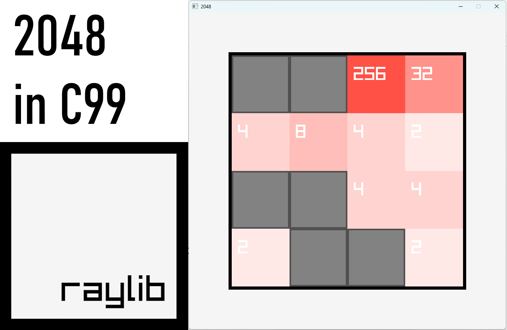

# raylib-2048
A simple copy of 2048 in raylib with C99.

This repo was created as a resource for my [tutorial](https://youtu.be/jACE6KsLbyA) on [Andrew Hamel Codes](https://www.youtube.com/channel/UCETp9EybHuo0AM6tZMzdHxA).

There isn't much code here whatsoever, so modifying it to use textured pieces, sound effects, a kind of leaderboard (whatever you'd like, really) could be easy! This was a rough one to get out the door, it had been a year since my last post. Glad to have it behind me and looking forward to what comes next :P

No web build this time. Next video is a 5.5 overview including it's new one-click Web build, so you can expect to see those moving forward.

